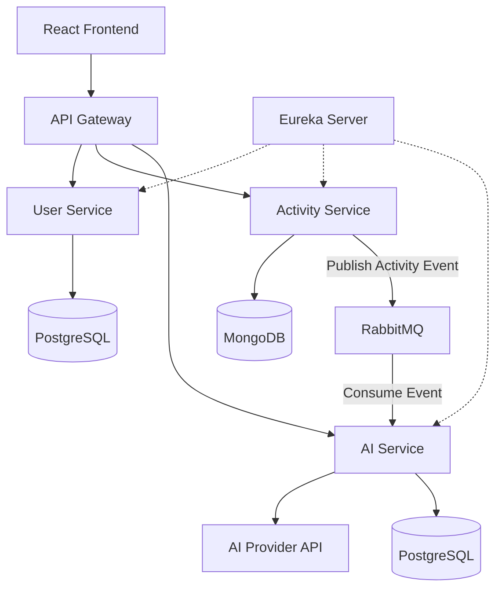
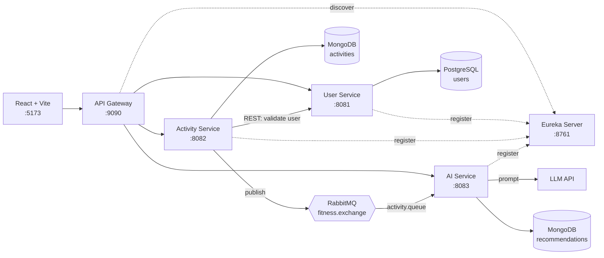

```mermaid
flowchart TD
    UI[React Frontend] --> GW[API Gateway]

    GW --> US[User Service]
    GW --> AS[Activity Service]
    GW --> AI[AI Service]

    EU[Eureka Server] -.-> US
    EU -.-> AS
    EU -.-> AI

    US --> PG[(PostgreSQL)]
    AS --> MG[(MongoDB)]

    AS -->|Publish Activity Event| MQ[RabbitMQ]
    MQ -->|Consume Event| AI

    AI --> LLM[AI Provider API]
    AI --> PG2[(PostgreSQL)]
```

```mermaid
flowchart LR
    UI["React + Vite<br/>:5173"] --> GW["API Gateway<br/>:9090"]

    GW --> US["User Service<br/>:8081"]
    GW --> AS["Activity Service<br/>:8082"]
    GW --> AI["AI Service<br/>:8083"]

    AS -- "REST: validate user" --> US
    US --> PG[("PostgreSQL<br/>users")]
    AS --> MA[("MongoDB<br/>activities")]
    AS -- "publish" --> MQ{{"RabbitMQ<br/>fitness.exchange"}}
    MQ -- "activity.queue" --> AI
    AI -- "prompt" --> LLM["LLM API"]
    AI --> MR[("MongoDB<br/>recommendations")]

    EU["Eureka Server<br/>:8761"]
    GW -. "discover" .-> EU
    US -. "register" .-> EU
    AS -. "register" .-> EU
    AI -. "register" .-> EU
```

Solid arrows show request and data flow. Dotted arrows show service registration and discovery through Eureka.
